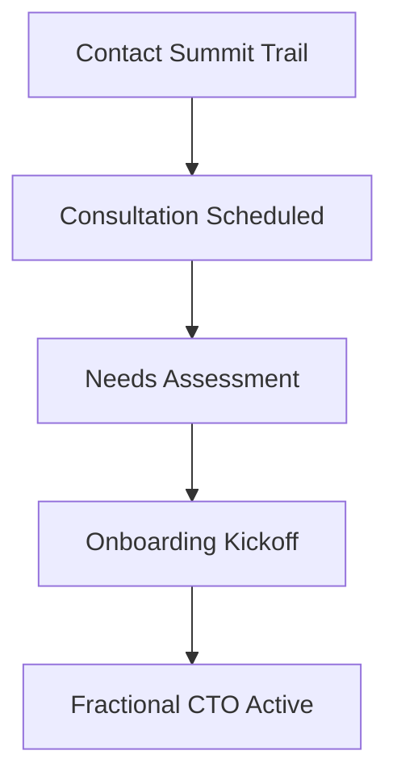

## Before You Begin

<Callout kind="info">
Before starting, gather key details about your company:
- Current technology stack and challenges
- Growth goals and timelines
- Team size and structure
- Budget expectations for fractional CTO services
</Callout>

Review these prerequisites to ensure a smooth consultation.



## Engage Summit Trail in Four Steps

Follow these steps to onboard your fractional CTO and accelerate your technology leadership.

<Steps>
  <Step title="Schedule Initial Consultation" icon="calendar">
    Reach out via email, Calendly, or phone to book a 30-minute discovery call. Summit Trail's experts will discuss your goals and challenges.

    <Tabs>
      <Tab title="Calendly" icon="calendar">
        Visit the scheduling link and select a time slot that works for you.
        
        ```
        https://calendly.com/summittrail/cto-consultation
        ```
      </Tab>
      <Tab title="Email" icon="mail">
        Send a detailed email to kick things off.
        
        <CodeGroup tabs="Plain Text,HTML">
        ```
        Subject: Request for Fractional CTO Consultation

        Hi Summit Trail Team,

        I'm interested in your fractional CTO services for [Company Name].
        Key challenges: [List 2-3 tech issues].
        Goals: [Scale to >50 engineers, modernize stack].

        Best,
        [Your Name]
        ```
        ```
        &lt;!DOCTYPE html&gt;
        &lt;html&gt;
        &lt;body&gt;
          &lt;p&gt;Hi Summit Trail Team,&lt;/p&gt;
          &lt;p&gt;I'm interested in your fractional CTO services for &lt;strong&gt;[Company Name]&lt;/strong&gt;.&lt;/p&gt;
          &lt;p&gt;Key challenges: [List 2-3 tech issues].&lt;/p&gt;
          &lt;p&gt;Goals: [Scale to &gt;50 engineers, modernize stack].&lt;/p&gt;
          &lt;p&gt;Best,&lt;br&gt;[Your Name]&lt;/p&gt;
        &lt;/body&gt;
        &lt;/html&gt;
        ```
        </CodeGroup>
      </Tab>
    </Tabs>
  </Step>

  <Step title="Assess Your Technology Needs" icon="search">
    During the call, share your current setup. Summit Trail will evaluate:
    
    | Area | Questions to Prepare |
    |------|---------------------|
    | Stack | What languages/frameworks? Any legacy systems? |
    | Team | Headcount? Skill gaps? Remote/hybrid? |
    | Goals | Scaling needs? Modernization priorities? |
    
    Expect a customized assessment report within 48 hours.
  </Step>

  <Step title="Onboarding Process" icon="check-circle">
    Sign the engagement agreement and complete onboarding:
    
    1. Share access to repos, tools (GitHub, Jira, Slack)
    2. Schedule weekly syncs
    3. Define KPIs (e.g., deployment frequency `<50%` improvement)
    
    <Callout kind="tip">
      Prepare a shared doc with your tech roadmap.
    </Callout>
  </Step>

  <Step title="First Steps After Engagement" icon="zap">
    Your fractional CTO dives in:
    - Week 1: Audit and roadmap
    - Week 2: Prioritized action plan
    - Ongoing: Hands-on guidance and execution
    
    Track progress with this sample dashboard config:
    
    ```yaml
    dashboard:
      metrics:
        - deployment_frequency: ">2/week"
        - lead_time: "<24h"
        - change_failure_rate: "<15%"
      tools:
        - github: "your-org/your-repo"
        - jira: "your-project"
    ```
  </Step>
</Steps>

## Resources and Next Steps

<Columns cols={3}>
  <Card title="Technology Audit Template" icon="file-text" href="https://docs.google.com/template/summit-trail-audit">
    Download a ready-to-use spreadsheet for self-assessment.
  </Card>
  <Card title="Case Studies" icon="book-open" href="/case-studies">
    See how others scaled with Summit Trail.
  </Card>
  <Card title="Contact Support" icon="message-circle" href="mailto:hello@summittrail.com">
    Questions? Email the team directly.
  </Card>
</Columns>

<Expandable title="Common Onboarding FAQs" default-open="false">
  **How long until impact?** Most clients see roadmap clarity in week 1.
  
  **What if needs change?** Engagements are flexible, month-to-month.
  
  **Billing details?** Invoiced monthly, net 30 terms.
</Expandable>

<Callout kind="success">
  Ready to scale? Schedule your consultation today and unlock expert technology leadership.
</Callout>