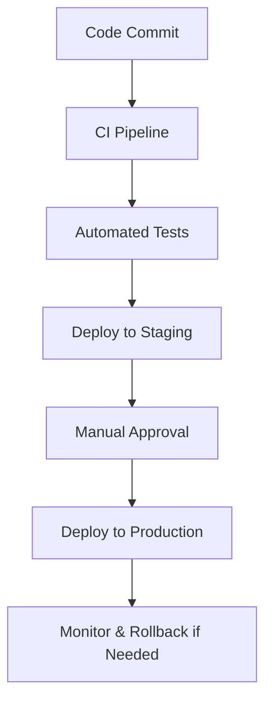

## Overview

Summit Trail provides fractional CTO services to help you build and scale technology organizations. As your expert technology leader, we partner with you to create growth strategies, modernize legacy systems, and execute at enterprise scale. Our approach combines deep technical expertise with proven leadership methodologies tailored to your business needs.

<Callout kind="info">
  Engage Summit Trail when you need strategic technology guidance without the overhead of a full-time C-suite hire.
</Callout>

## Core Services

Explore our four pillar services designed to accelerate your technology transformation.

<Columns cols={2}>
  <Card title="Technology Growth Planning" icon="trending-up" href="#technology-growth-planning">
    Develop roadmaps for sustainable expansion and innovation.
  </Card>
  <Card title="System Modernization" icon="refresh-cw" href="#system-modernization">
    Migrate legacy systems to modern, efficient architectures.
  </Card>
  <Card title="Execution and Scaling" icon="rocket" href="#execution-scaling">
    Implement processes for reliable delivery at scale.
  </Card>
  <Card title="Customized Leadership" icon="users" href="#customized-leadership">
    Tailored executive guidance for your unique challenges.
  </Card>
</Columns>

## Technology Growth Planning

You start by assessing your current technology stack and business goals. We create a multi-year roadmap that aligns engineering with revenue growth.

### Key Strategies
- **Talent Acquisition**: Build high-performing teams with targeted hiring frameworks.
- **Innovation Pipelines**: Establish R&D processes to prototype and launch new features.
- **Roadmap Prioritization**: Use data-driven frameworks like RICE scoring to focus efforts.

<Expandable title="Growth Planning Framework" default-open="true">
  Our framework includes quarterly planning cycles:

  1. Audit current capabilities.
  2. Define OKRs aligned with business objectives.
  3. Prioritize initiatives using impact vs. effort matrices.
</Expandable>

## System Modernization Approaches

Modernize your infrastructure without disrupting operations. Choose from proven migration paths.

<Tabs>
  <Tab title="Cloud Migration" icon="cloud">
    Transition to cloud-native architectures for elasticity and cost savings.

    <Steps>
      <Step title="Assess" icon="search">
        Inventory legacy systems and dependencies.
      </Step>
      <Step title="Refactor" icon="code">
        Containerize applications using Docker.
      </Step>
      <Step title="Deploy" icon="upload-cloud">
        Migrate to Kubernetes on AWS or GCP.
      </Step>
    </Steps>

    ```yaml
    version: '3.8'
    services:
      app:
        image: your-app:latest
        ports:
          - "8080:8080"
        environment:
          - DATABASE_URL=postgres://user:pass@db:5432/prod
    ```
  </Tab>
  <Tab title="Microservices" icon="layers">
    Break monoliths into scalable services.

    <CodeGroup tabs="JavaScript,Python">
    ```javascript
    // Express.js service example
    const express = require('express');
    const app = express();

    app.get('/api/users', async (req, res) => {
      const users = await fetchUsersFromDB();
      res.json(users);
    });

    app.listen(3000, () => console.log('User service running'));
    ```
    ```python
    # FastAPI service example
    from fastapi import FastAPI
    app = FastAPI()

    @app.get("/api/users")
    async def get_users():
        users = await fetch_users_from_db()
        return users

    if __name__ == "__main__":
        import uvicorn
        uvicorn.run(app, host="0.0.0.0", port=3000)
    ```
    </CodeGroup>
  </Tab>
</Tabs>

## Execution and Scaling Methodologies

Scale your operations with battle-tested processes. We implement CI/CD pipelines, observability, and DevOps practices.



<Callout kind="tip">
  Start with a maturity assessment to identify quick wins in your delivery pipeline.
</Callout>

## Customized Leadership Solutions

We adapt our services to your stage and industry. From startups needing rapid scaling to enterprises modernizing core platforms, our fractional CTOs embed as your strategic partner.

- **Weekly Cadence**: Alignment meetings and technical reviews.
- **On-Demand Expertise**: Access to our network of specialists.
- **Performance Metrics**: Track progress against defined KPIs.

<Columns cols={3}>
  <Card title="Startups" icon="sparkles" horizontal>
    Hyper-growth engineering leadership.
  </Card>
  <Card title="Mid-Market" icon="package" horizontal>
    Systems scaling and process optimization.
  </Card>
  <Card title="Enterprise" icon="building-2" horizontal>
    Legacy modernization and governance.
  </Card>
</Columns>